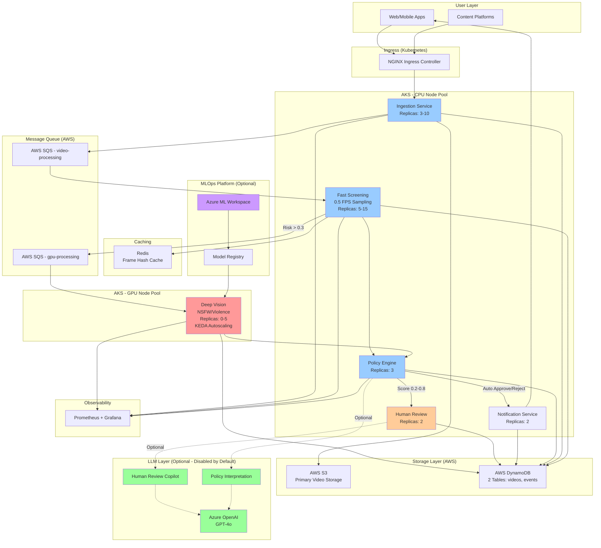
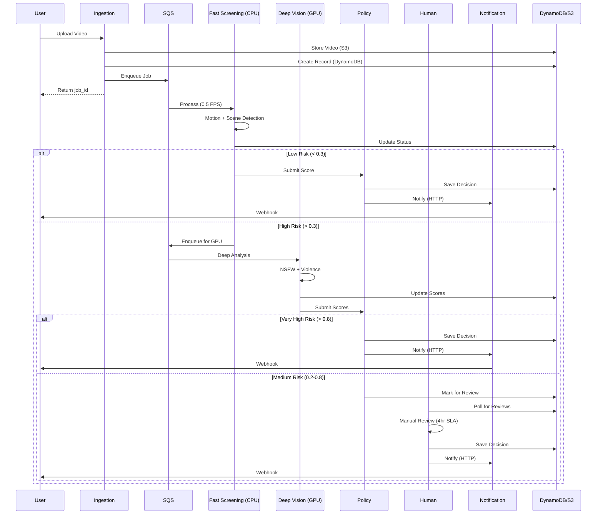
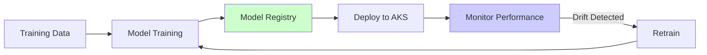
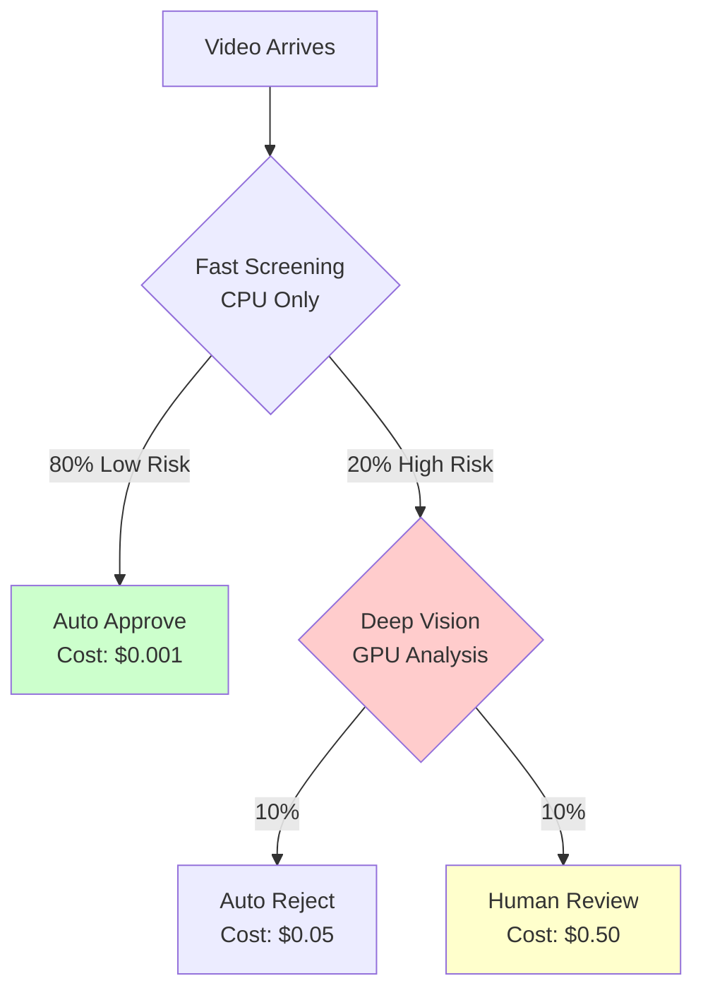
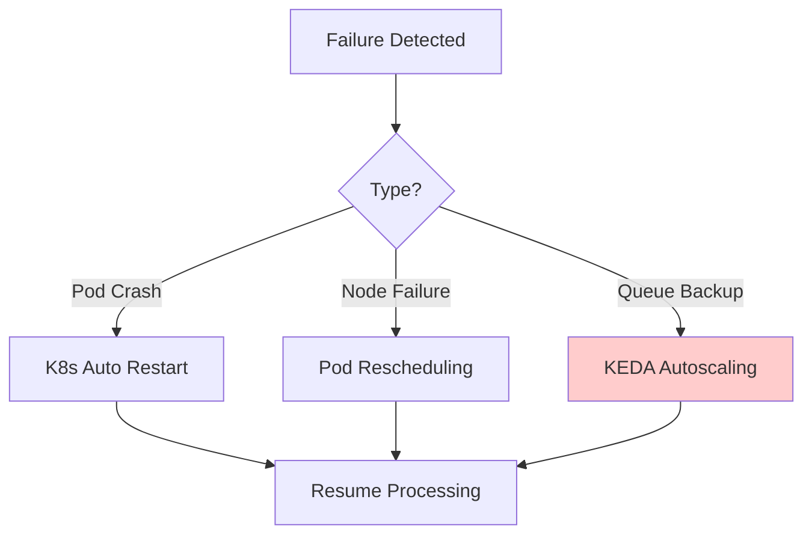

# Guardian AI - Simplified System Architecture

## Complete Data Flow Diagram



## Component Interaction Flow



## MLOps Lifecycle (Optional)



## Cost Optimization Strategy



---

## Key Design Decisions

### 1. Adaptive Frame Sampling
- **0.5 FPS** for CPU screening (fast, cost-effective)
- **1 FPS** for GPU analysis (balance accuracy and cost)
- **Not 30 FPS** (wasteful, no accuracy gain)

### 2. GPU Scale-to-Zero
- KEDA monitors queue depth
- Scales from 0 → 5 replicas based on demand
- 90% cost savings during off-peak hours

### 3. Simplified Multi-Cloud Strategy
- **AWS**: Storage, queues, database (S3, SQS, DynamoDB)
- **Azure**: Compute, ML (AKS, ACR, Azure ML)
- **Design**: Best-of-both-clouds, minimal services

### 4. Human Review Triggers
- Confidence score between 0.2 - 0.8
- Conflicting model outputs
- User appeals
- Regulatory requirements

### 5. Azure OpenAI Integration (Optional - Disabled by Default)
**Core Principle**: LLMs are **adjacent, not foundational**. They assist but never make final moderation decisions.

**Where LLMs Can Be Used** (if enabled):
1. **Human Review Copilot** - Summarizes flagged content, suggests actions
2. **Policy Interpretation** - Converts natural language policies to rules
3. **Explanation Generation** - Generates user-facing explanations

**Configuration**:
- Default: `AZURE_OPENAI_ENABLED=false`
- Services degrade gracefully if LLM unavailable
- Cost-bounded (only for human review assistance)

**Where LLMs Are NOT Used**:
- ❌ Primary moderation (Fast Screening, Deep Vision)
- ❌ Real-time decision making (Policy Engine)
- ❌ Critical path operations

---

## Performance Characteristics

| Stage | Latency | Cost per Video | Throughput |
|-------|---------|----------------|------------|
| Ingestion | 2s | $0.0001 | 1000/s |
| CPU Screening | 5-10s | $0.001 | 500/s |
| GPU Analysis | 30-45s | $0.05 | 50/s |
| Human Review | 4hr SLA | $0.50 | 20/hr |

---

## Simplified Architecture Components

### ✅ Included (Essential for Learning)

**AWS Services (3)**:
1. S3 - Video storage
2. SQS - 2 queues (video-processing, gpu-processing)
3. DynamoDB - 2 tables (videos, events)

**Azure Services (3)**:
1. AKS - Kubernetes cluster
2. ACR - Container registry
3. Azure ML - Model Registry (optional)

**Open Source (3)**:
1. Redis - Caching
2. KEDA - GPU autoscaling
3. Prometheus + Grafana - Monitoring

**Total: 9 services**

### ❌ Removed (Not Essential for Learning)

- Azure Front Door + CDN → Use NGINX Ingress
- WAF + DDoS Protection → Use Kubernetes NetworkPolicies
- API Management → Direct service communication
- Azure Durable Functions → Not implemented
- Application Insights + Log Analytics → Use Prometheus + Grafana
- 2 extra SQS queues → Use direct HTTP calls
- 2 extra DynamoDB tables → Consolidated into videos table

### ⚠️ Optional (Disabled by Default)

- Azure OpenAI - Set `AZURE_OPENAI_ENABLED=true` to enable
- Azure ML Advanced Features - A/B testing, drift detection
- S3 Glacier Lifecycle - Archive old videos

---

## Failure Modes & Recovery



---

## Cost Comparison

### Original Architecture:
- AWS: ~$50-100/month (4 SQS + 4 DynamoDB + S3)
- Azure: ~$200-400/month (AKS + ACR + Azure ML + OpenAI + Monitoring)
- **Total: $250-500/month**

### Simplified Architecture:
- AWS: ~$25-40/month (2 SQS + 2 DynamoDB + S3)
- Azure: ~$100-150/month (AKS + ACR, minimal Azure ML)
- **Total: $125-190/month**

**Savings: ~50-60% reduction**

---

## Optional Features Configuration

### Enable Azure OpenAI (Optional)
```bash
# Set in .env or Kubernetes ConfigMap
AZURE_OPENAI_ENABLED=true
AZURE_OPENAI_API_KEY=your_key
AZURE_OPENAI_API_VERSION=2024-02-15-preview
AZURE_OPENAI_ENDPOINT=https://your-resource.openai.azure.com/
AZURE_OPENAI_DEPLOYMENT_NAME=gpt-4o
```

### Enable S3 Glacier Lifecycle (Optional)
```bash
# Uncomment lifecycle policy in scripts/setup-aws.sh
# Archives videos to Glacier after 90 days
# Saves ~70% on storage costs
```

### Enable Azure ML Advanced Features (Optional)
```bash
# Follow MLOps advanced guide for:
# - A/B testing
# - Drift detection
# - Auto-rollback
```

---

**Last Updated**: 2026
**Version**: 2.0 (Simplified)
**Status**: Production Ready
**Cost**: ~$125-190/month (50% reduction)
**Services**: 9 core services (down from 15+)
